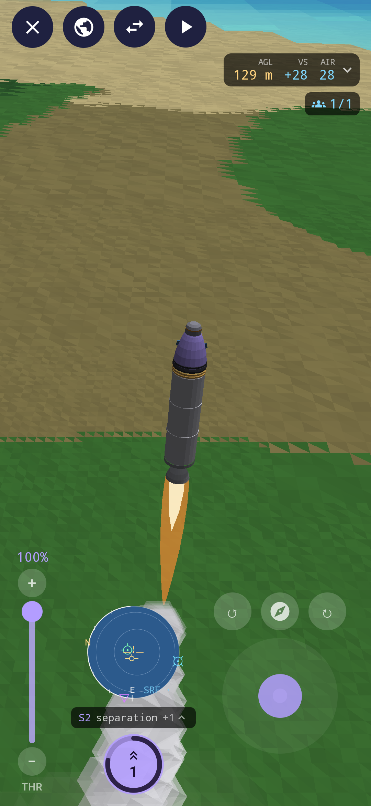
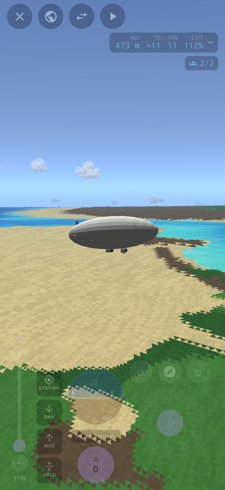
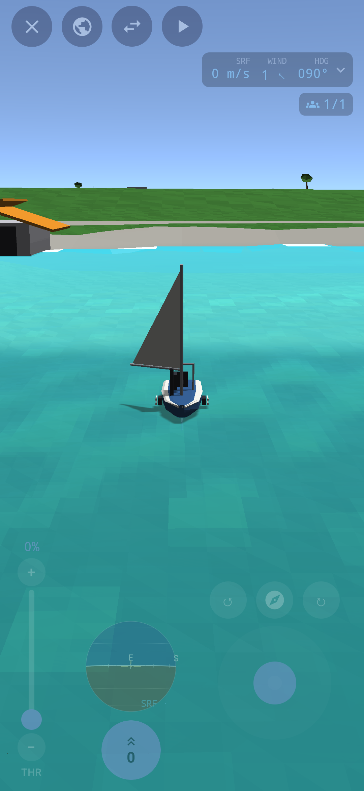
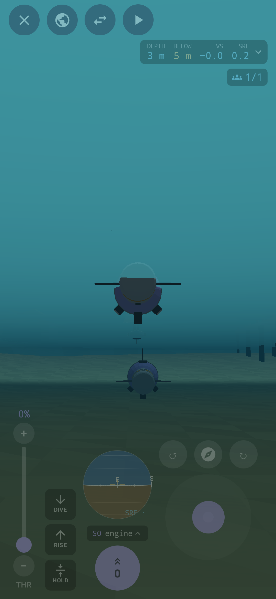
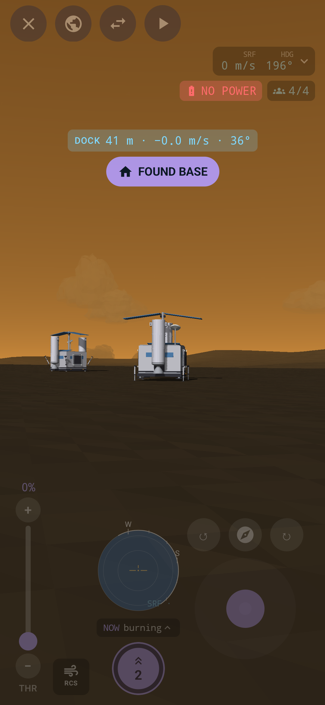

# Apogee

Apogee is a physics sim for Android 8.1+, and you can play it in a browser too.

Build vehicles out of a variety of parts and take them wherever you want - on land, in the air, in space, in (and under) the sea.
Make rovers, planes, rockets, drones, balloons and airships, ships and submarines. Build bases on land, in the air, and on the water.

Play in sandbox mode and explore freely with a variety of bases on different bodies and stock vehicles to take there. Or play in career mode and explore the solar system for yourself, unlocking new parts with the various feats you achieve and building your way up from nothing. 

Do it with friends, too. Apogee is multiplayer at its core, includes a standalone server (easily run with docker) but also runs one
on your phone every time you play a game. Build things together, explore the solar system, come to each other's rescue and show off what you can do.

The game is complete enough to play and test so I am opening it up to the world to join me in doing so. Build things, break things, tell me what works or what doesn't. 

Join me in the #apogee channel **[on my discord](https://discord.gg/9Wun47jGC6)** to discuss the game or report any bugs.
<br>You can also add an issue here for me to look at.

Enjoy!
Dan

  

  

---

## What's in it

**A solar system.** A sun and its planets and moons, each with its own gravity, air, weather and ground. Days, tides and launch windows come round the way they should. Terra is home, with the Cape's launch complex, an airfield, a harbour and a coast to explore, and every other world with solid ground can be landed on.

**Building.** Vehicle Assembly puts parts together node by node, with symmetry, staging, action groups, saved assemblies you can drop back in, and a stats card that tells you what you've made: its Δv and thrust, whether it hovers or floats, how high it'll go. Saved craft sort themselves into rockets, planes, rovers, boats, submarines, rotorcraft, airships and bases, each with a picture.

**Flying anything.**
- Rockets with staging, gimballed engines, stability assist, planned burns and an autopilot for burns and landings.
- Planes with flaps, cruise control, and an approach cue and landing lights at the runway.
- Rovers and haulers with suspension, steering, hitches and a winch.
- Boats with hulls that take on water, keels, rudders and sails, and submarines with ballast, pressure hulls and sonar.
- Helicopters and drones on rotors, and balloons and airships on gas.
- A keeper core that holds a craft still in the air or on the water.

**The sea.** Waves that move what floats on them, storms, tides, currents out in the open ocean, and a deep world underneath with canyons, vents and places to find.

**Bases.** Found a base on any solid world, or on a platform floating on the sea or in the sky. Bases have pads to launch from, power, and industry that digs ore and water and makes propellant from them.

**Crew.** Named astronauts who fly your craft, walk on other worlds, climb ladders, plant flags and can be rescued.

**A career, or free play.** The career starts from nothing. You earn insight with feats (the first time into orbit, the first landing on another world, a hover held by hand, a kilometre sailed on the wind alone) and spend it on a tech tree. Free play has every part and every craft from the start.

**Save points.** In your own world you can take a save point, go back to it, or revert a flight to its launch.

**Playing together.** Host a game on your network, join someone else's, or run a dedicated server for a persistent world everyone comes back to.

---

## Installing

The easiest way to install Apogee and keep it up to date is through my F-Droid repo:

[https://roge-rm.gitlab.io/repo](https://roge-rm.gitlab.io/repo?fingerprint=80438B253C257BCCE05CDCB9E3AC9B6174C2250659962B14FCBE7F32FD42D53E)

Then search for Apogee in F-Droid. When a new version comes out, F-Droid will offer it as an update.

You can also download the APK from the [Releases](https://github.com/roge-rm/Apogee/releases) page and sideload it.

## Playing in a browser

You can play it in a browser too, at [roge-rm.gitlab.io/play/apogee](https://roge-rm.gitlab.io/play/apogee/). It's the same game, solo, in a career or the sandbox, and your worlds and craft are kept in the browser. It can't host or join a game, because a web page can't open the connections that needs. It wants a recent browser with WebGL 2 and WebAssembly GC (Chrome or Edge 119, Firefox 120, or Safari 18.2, or anything newer).

With a mouse, drag to look around, use the wheel to zoom, and drag with the right button to pan in the Vehicle Assembly. With a keyboard:

| | |
|---|---|
| W S, or up and down | pitch |
| A D, or left and right | yaw, and steering |
| Q E | roll |
| Shift, Ctrl | throttle up and down |
| Z, X | full throttle, and off |
| Space | stage |
| M | the map |
| C | the camera: free, chase, cockpit or locked |
| V | steer by the screen or by the craft's nose |
| T | stability assist |
| R | thrusters |
| B | brakes |
| G | gear and legs |
| F | flaps |
| Esc | back, or the flight menu |

## Playing with a controller

A controller works on Android and in a browser, and so do the controls built in to a handheld. I laid it out for the Retroid Pocket Mini, but any controller Android or the browser sees as a gamepad will do. Here's how it starts:

| | |
|---|---|
| Left stick | steer (and walk, on foot) |
| Right stick | look around |
| R2, L2 | throttle up and down, faster the harder you press |
| L1, R1 | roll |
| A | stage (hold it a moment) |
| B | brakes |
| X | stability assist |
| Y | the map |
| D-pad up and down | zoom |
| D-pad left and right | time warp |
| L3 | thrusters |
| R3 | the camera |
| Select | gear and legs |
| Start | the flight menu |

On foot, A jumps, B grabs a ladder, X boards and Select plants a flag. You can change any of it in Settings, under Controls, then Controller buttons. Press a button there to find its row. In the menus, the D-pad or left stick moves, A picks and B goes back. The touch stick steps aside while the controller's flying, and comes back when you touch the screen. A browser only lets a page see a controller once you've pressed one of its buttons with the page in front, so press one first.

## Building it

You need a JDK (17 or newer, which Gradle needs to run) and, for the app, the Android SDK.

```sh
./gradlew :app:assembleDebug                   # the debug APK, in app/build/outputs/apk/debug/
./gradlew :app:assembleRelease                 # the release APK, in app/build/outputs/apk/release/
./gradlew :shared:wasmJsBrowserDistribution    # the web page, in shared/build/dist/wasmJs/productionExecutable/
```

The web page's sound is the same synth the app uses, built as WebAssembly with [Emscripten](https://emscripten.org). The build looks for it in `~/.local/share/emsdk` (or wherever `EMSDK` says), and without it the page comes out silent.

The release build is signed with my key, which lives outside the repository, so anywhere else it comes out unsigned.

The tests:

```sh
./gradlew --continue :core:test :net:test :server:test :dedicated:test :shared:testAndroidHostTest
```

The app is left out of the build when there's no Android SDK, so a checkout for the server alone needs nothing but a JDK.

## Running a server

A dedicated server is a persistent world that players join from the game's **Join a Game** screen. How to run it, with Docker or without, is in [dedicated/README.md](dedicated/README.md).

## How it's laid out

| | |
|---|---|
| `core` | The simulation: the solar system, physics, parts and craft, the sea and the weather, bases, crew and the career. It's plain Kotlin with no Android in it, so it's tested on its own. |
| `net` | How clients and servers talk, and a client's prediction of the craft it's flying. |
| `server` | The game server, the same one whether a phone hosts or a dedicated server runs it. |
| `dedicated` | The standalone server, with its admin channel. |
| `web-admin` | The dedicated server's admin page. |
| `shared` | The game itself, for the app and the web page alike: the renderer, the sound, and the flight and builder screens. |
| `app` | The Android app around it. |
| `web` | The synth's build for the web page. |
| `art` | The icon and the tools for the parts' pictures. |

The server is in charge of every world. The app runs its own copy of the craft you're flying to hide the lag, and the server's word always wins.

## Licence

Apogee is free software under the **GNU General Public License, version 3 or later**. See [LICENSE](LICENSE).

Copyright © 2026 Dan Hunke.
