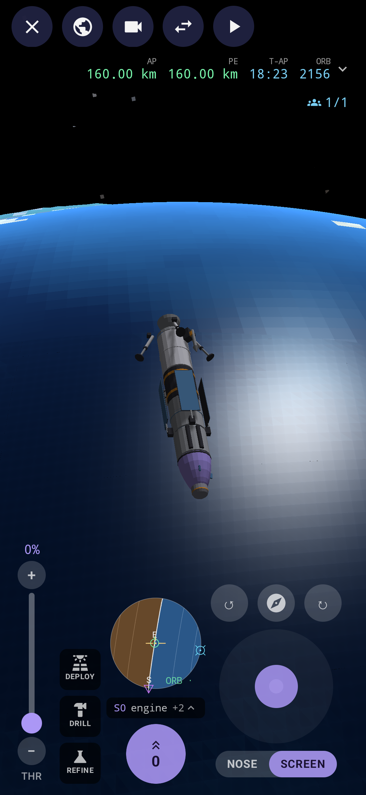
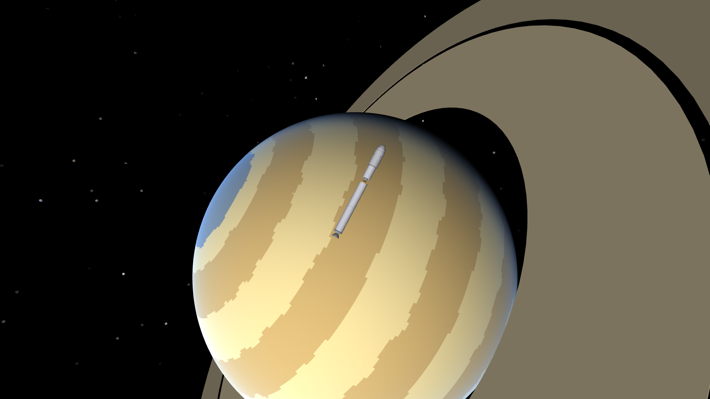
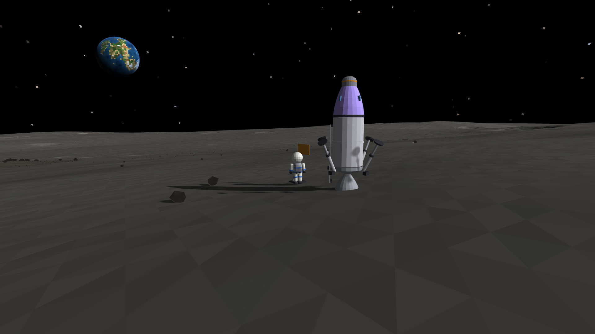
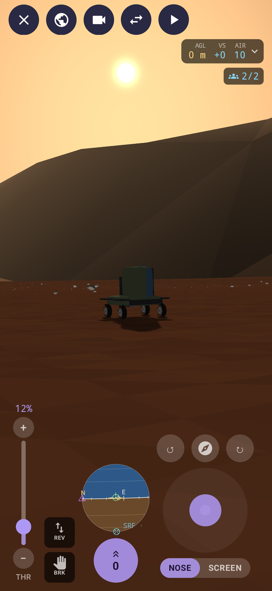
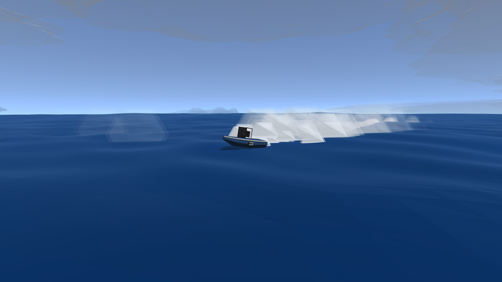
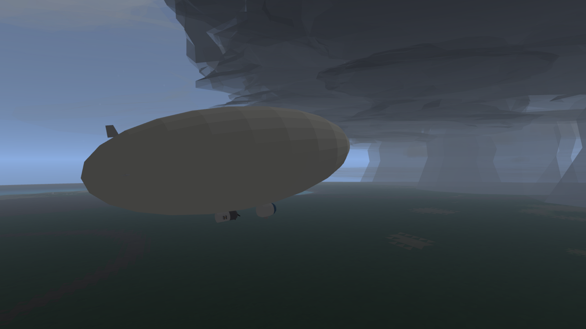

# Apogee

Apogee is a physics sim for Android 8.1+, and you can play it in a browser too.

Build vehicles out of a variety of parts and take them wherever you want - on land, in the air, in space, in (and under) the sea.
Make rovers, planes, rockets, drones, balloons and airships, ships and submarines. Build bases on land, in the air, and on the water.

Play in sandbox mode and explore freely with a variety of bases on different bodies and stock vehicles to take there. Or play in career mode and explore the solar system for yourself, unlocking new parts with the various feats you achieve and building your way up from nothing. 

Do it with friends, too. Apogee is multiplayer at its core, includes a standalone server (easily run with docker) but also runs one
on your phone every time you play a game. Build things together, explore the solar system, come to each other's rescue and show off what you can do.

The game is complete enough to play and test so I am opening it up to the world to join me in doing so. Build things, break things, tell me what works or what doesn't. 

Join me in the #apogee channel **[on my discord](https://discord.gg/9Wun47jGC6)** to discuss the game or report any bugs.
<br>You can also add an issue here for me to look at.

Enjoy!
Dan

  

  

---

## What's in it

**A solar system.** A sun, planets and moons, each with its own gravity, air, weather and ground. Terra is home, with the Cape's launch complex, an airfield, a harbour and a coast. Every world with solid ground can be landed on.

**Building.** Vehicle Assembly puts parts together node by node, with symmetry, staging, action groups and saved assemblies. A stats card shows Δv, thrust, whether it hovers or floats, and how high it'll go.

**Flying anything.**
- Rockets with staging, gimballed engines, stability assist, planned burns and an autopilot for burns and landings.
- Planes with flaps, cruise control, and an approach cue at the runway.
- Rovers and haulers with suspension, hitches and a winch.
- Boats with hulls that take on water, keels, rudders, sails, outboards and water jets, and submarines with ballast and sonar.
- Ships, a schooner, barges and a harbour tug to tow or push them. Anything parked on a deck rides along.
- Decks to fly from at sea: a landing barge for helicopters, and the Flat Top with a catapult and arresting wires.
- Helicopters and drones, and balloons and airships.
- Auto land for anything that flies. It's in the stability assist menu.
- Crew who swim, dive and walk on the sea floor, as deep as their suit allows.

**The sea.** Waves that move what floats, storms, tides, currents, and a deep world underneath with canyons, vents and places to find. For big seas, launch at the Roaring Sea with the weather set to Wild.

**Bases.** Found a base on any solid world, floating on the sea or in the sky, or on the sea floor. Bases have pads, power, and industry that turns ore and water into propellant.

**Crew.** Named astronauts who fly your craft, walk on other worlds, climb ladders, plant flags and can be rescued.

**A career, or free play.** The career starts from nothing. Feats earn insight, which you spend on a tech tree. Free play has every part and craft from the start.

**Save points.** In your own world you can take a save point, go back to it, or revert to the launch.

**Playing together.** Host a game on your network, join someone else's, or run a dedicated server for a world everyone comes back to.

---

## Installing

The easiest way to install Apogee and keep it up to date is through my F-Droid repo:

[https://hunke.ws/fdroid/repo](https://hunke.ws/fdroid/repo?fingerprint=80438B253C257BCCE05CDCB9E3AC9B6174C2250659962B14FCBE7F32FD42D53E)

Then search for Apogee in F-Droid. When a new version comes out, F-Droid will offer it as an update.

You can also download the APK from the [Releases](https://github.com/roge-rm/Apogee/releases) page and sideload it.

## Playing in a browser

You can play it at [hunke.ws/fdroid/play/apogee](https://hunke.ws/fdroid/play/apogee/). It's the same game, solo only, and your worlds and craft are kept in the browser. It needs WebGL 2 and WebAssembly GC (Chrome or Edge 119, Firefox 120, Safari 18.2 or newer).

Drag to look around, use the wheel to zoom, and right-drag to pan in the Vehicle Assembly. On a keyboard:

| | |
|---|---|
| W S, or up and down | pitch |
| A D, or left and right | yaw, and steering |
| Q E | roll |
| Shift, Ctrl | throttle up and down |
| Z, X | full throttle, and off |
| Space | stage |
| M | the map |
| C | the camera: free, chase, cockpit or locked |
| V | steer by the screen or by the craft's nose |
| T | stability assist |
| R | thrusters |
| B | brakes |
| G | gear and legs |
| F | flaps |
| Esc | back, or the flight menu |

## Playing with a controller

Any gamepad works on Android and in a browser, including a handheld's built-in controls. I laid it out for the Retroid Pocket Mini:

| | |
|---|---|
| Left stick | steer (and walk, on foot) |
| Right stick | look around |
| R2, L2 | throttle up and down, faster the harder you press |
| L1, R1 | roll |
| A | stage (hold it a moment) |
| B | brakes |
| X | stability assist |
| Y | the map |
| D-pad up and down | zoom |
| D-pad left and right | time warp |
| L3 | thrusters |
| R3 | the camera |
| Select | gear and legs |
| Start | the flight menu |

On foot, A jumps, B grabs a ladder, X boards and Select plants a flag. In the water the triggers swim down and up. In the menus, the D-pad moves, A picks and B goes back. You can change any of it in Settings, under Controls. In a browser, press a button first so the page can see the controller.

## Building it

You need JDK 17 or newer, and the Android SDK for the app.

```sh
./gradlew :app:assembleDebug                   # the debug APK, in app/build/outputs/apk/debug/
./gradlew :app:assembleRelease                 # the release APK, in app/build/outputs/apk/release/
./gradlew :shared:wasmJsBrowserDistribution    # the web page, in shared/build/dist/wasmJs/productionExecutable/
```

The web page's sound needs [Emscripten](https://emscripten.org) in `~/.local/share/emsdk` (or wherever `EMSDK` says). Without it the page is silent.

The release build is signed with my key, which isn't in the repository, so anywhere else it comes out unsigned.

The tests:

```sh
./gradlew --continue :core:test :net:test :server:test :dedicated:test :shared:testAndroidHostTest
```

Without an Android SDK the app is left out, so the server builds with just a JDK.

## Running a server

A dedicated server is a persistent world that players join from **Join a Game**. See [dedicated/README.md](dedicated/README.md), with Docker or without.

## How it's laid out

| | |
|---|---|
| `core` | The simulation: the solar system, physics, parts and craft, the sea, weather, bases, crew and the career. Plain Kotlin, no Android. |
| `net` | How clients and servers talk, and a client's prediction of the craft it's flying. |
| `server` | The game server, the same one whether a phone hosts or a dedicated server runs it. |
| `dedicated` | The standalone server, with its admin channel. |
| `web-admin` | The dedicated server's admin page. |
| `shared` | The game itself, for the app and the web page alike: the renderer, the sound, and the flight and builder screens. |
| `app` | The Android app around it. |
| `web` | The synth's build for the web page. |
| `art` | The icon and the tools for the parts' pictures. |

The server runs every world. The app predicts the craft you're flying to hide lag, and the server always wins.

## Licence

Apogee is free software under the **GNU General Public License, version 3 or later**. See [LICENSE](LICENSE).

Copyright © 2026 Dan Hunke.

Disclaimer: I am not a great programmer and this was made using Claude Opus 5.0/5.5
